# Assessment Project - Vanity Number Generator

To run the program and deploy resources, first clone the repo to local directory. Configure the AWS CLI, signing in on the desired IAM account.

- Amazon Connect is not available in all AWS Regions. You will need to check that your CLI is set to an available region (list found here: [link](https://docs.aws.amazon.com/connect/latest/adminguide/regions.html#amazonconnect_region) ).

From the CLI:

- Run `npm install` to download dependencies.
- Run `npm run build` to compile Typescript files.
- Run `npx cdk synth` to generate a CloudFormation template from code.
- Run `npx cdk deploy` to deploy stack.

# Vanity Number Generator Architecture

This diagram illustrates the architecture of the Vanity Number Generator solution, showing how the different AWS services interact with each other.

## Architecture Components

### Amazon Connect

- **Connect Instance**: Handles incoming phone calls
- **Contact Flow**: Orchestrates the call experience, including invoking Lambda and playing messages

### AWS Lambda

- **Vanity Lambda Function**: Generates vanity number options based on the caller's phone number
- **Dictionary File**: Contains a list of English words used to score and rank vanity number options

### Amazon DynamoDB

- **Vanity Table**: Stores the generated vanity number options for each caller's phone number

## Data Flow

1. A customer calls the phone number associated with the Amazon Connect instance.

2. The Connect instance executes the configured contact flow.

3. The contact flow invokes the Vanity Lambda function, passing the caller's phone number.

4. The Lambda function loads the dictionary file to use for scoring vanity number options.

5. The Lambda function:

   - Converts the phone number digits to possible letter combinations
   - Generates all possible vanity number options
   - Scores each option based on matching words in the dictionary
   - Stores the top 5 options in DynamoDB
   - Returns the top 3 options to the contact flow

6. The contact flow receives the top 3 vanity number options and updates the contact attributes.

7. The contact flow plays a message to the caller with the three vanity number options.

## Implementation Details

### Lambda Function Logic

1. Extracts the phone number from the event
2. Ignores the area code when generating combinations
3. Generates all possible letter combinations for the remaining digits
4. Scores combinations based on matching words in the dictionary
5. Stores the top 5 options in DynamoDB
6. Returns the top 3 options to the contact flow

### DynamoDB Schema

- **Partition Key**: `phoneNumber` (String)
- **Attributes**: `suggestions` (String Set) - Contains the top 5 vanity number options

### CDK Infrastructure

The entire solution is deployed using AWS CDK, which provisions:

- DynamoDB table
- Lambda function with environment variables
- Connect instance
- Lambda integration with Connect
- Contact flow configuration

# Vanity Number Generator Call Flow

This diagram illustrates the sequence of actions in the Amazon Connect contact flow for the Vanity Number Generator.

## Call Flow Details

1. **Call Starts**: A customer calls the phone number associated with the Amazon Connect instance.

2. **Invoke Lambda Function**: The contact flow invokes the Vanity Lambda function, passing the caller's phone number.

   - The Lambda function generates vanity number options based on the caller's phone number
   - It stores these options in DynamoDB
   - It returns the top 3 options to the contact flow

3. **Update Contact Attributes**: The contact flow updates the contact attributes with the three vanity number options returned by the Lambda function.

   - First option: `$.External.optionOne`
   - Second option: `$.External.optionTwo`
   - Third option: `$.External.optionThree`

4. **Play Vanity Numbers Message**: The contact flow plays a message to the caller with the three vanity number options.

   - Message: "Here are the best three options based on your phone number. The first number is: [first option], the second number is [second option], and the third number is [third option]"

5. **Error Message** (if any step fails): The contact flow plays an error message.

   - Message: "I'm sorry, something went wrong. Please try again later."

6. **Disconnect Call**: The contact flow disconnects the call.

### Challenges

The main challenges I anticipated were learning the CDK framework, deploying an Amazon Connect instance (with contact flow) from an IaC context, and implementing the logic to generate and rank vanity numbers.

I started by reading the documentation and tutorials on the AWS website, and I found that CDK was less challenging to begin building than I had anticipated. I quickly understood the process of declaring and deploying Lambda functions and DynamoDB tables.

I found it less easy to find information in the documentation for Amazon Connect. Due to this, I began the project by building out the other necessary resources and associating them with a Connect instance which I deployed from the AWS console. When I was happy with the other elements, I returned to the Connect documentation, and after a lot of searching found the Level 1 constructs for Connect resources. I was then able to add the needed code to deploy all resources from the command line.

To implement the vanity number logic, I returned to some algorithm practice I had done in the past, and found a solution for generating all possible letter combinations from a phone number. I then wrote a function to score and sort the combinations, giving higher scores to longer words.

### Incomplete solutions / things to add

- The output of the best vanity options could be formatted better to make the prompt audio more understandable (example: "1555FLOWER1" may not be as clearly read as "1-555-FLOWER-1").

- The test suites could be more comprehensive to ensure that future development doesn't cause feature breaks.

- The project could use more robust error handling and authorization checks to combat malicious input.
